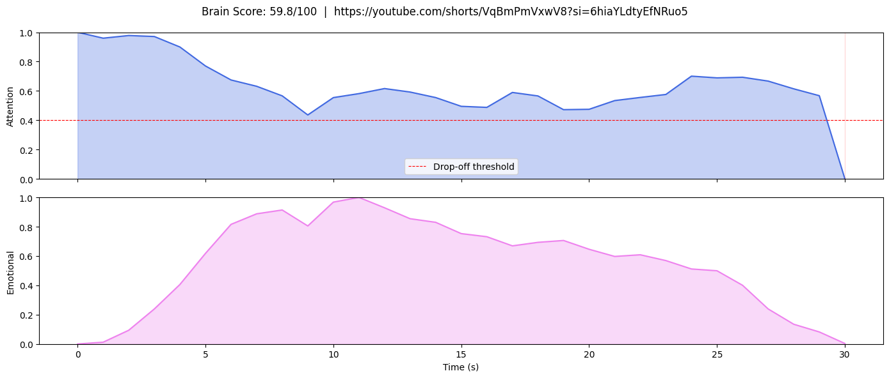
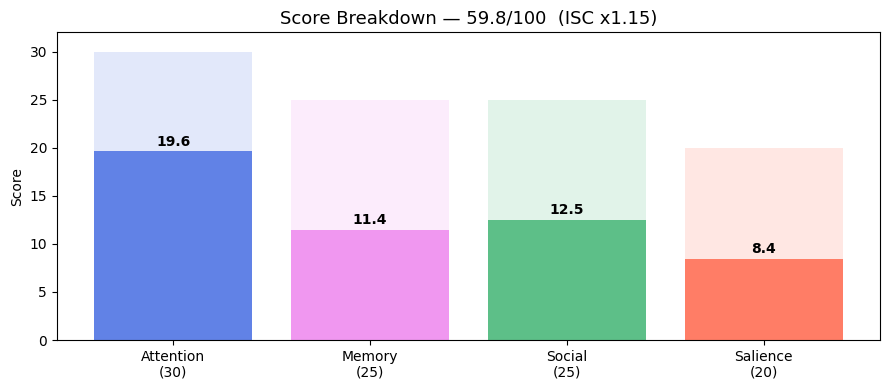

# BoldSignal

**Your content, through the brain's eyes.**

[](https://colab.research.google.com/github/deep0patel/boldsignal/blob/main/boldsignal_batch.ipynb)
[](https://creativecommons.org/licenses/by-nc/4.0/)
[](https://www.python.org/downloads/)

---

## What Is This

An experiment. I wanted to see if Meta's TRIBE v2 — a model that predicts fMRI brain responses to video — could be turned into something interpretable for content analysis.

TRIBE v2 takes a video and outputs predicted activation across ~20,000 cortical voxels per 2-second timestep on the fsaverage5 surface. Those predictions represent how the average brain might respond neurally to a given piece of content. I built a scoring layer on top of it that aggregates those voxel predictions into four neuroscience-grounded dimensions and combines them into a single Brain Score (0–100).

I also added an Inter-Subject Correlation (ISC) proxy as a final multiplier — a rough measure of how consistently different brains tend to respond to the same stimulus.

This is a proof-of-concept. The scoring approach has scientific grounding (cited below) but the normalisation constants, dimension weights, and ISC proxy are hand-tuned heuristics. **Take the numbers as directional signals, not ground truth.**

---

## Output

I ran it on five YouTube Shorts. Here's what came out.

> [Example video](https://youtube.com/shorts/VqBmPmVxwV8)

### Attention and Emotional Timeline


### Score Breakdown


```json
[
  {
    "url": "https://youtube.com/shorts/VqBmPmVxwV8?si=6hiaYLdtyEfNRuo5",
    "video_id": "VqBmPmVxwV8",
    "timestamp": "2026-04-06T03:46:33.918380",
    "brain_score": 59.8,
    "isc_multiplier": 1.15,
    "content_mode": "non_narrative",
    "dimensions": {
      "sustained_attention": 19.62,
      "emotional_memory": 11.43,
      "social_processing": 12.5,
      "sensory_salience": 8.43
    },
    "error": null,
    "processing_time_s": 1265.0,
    "inference_cached": false
  },
  {
    "url": "https://youtube.com/shorts/IQxea9UB1nQ?si=UT58Un96hwoj0Qan",
    "video_id": "IQxea9UB1nQ",
    "timestamp": "2026-04-06T04:07:38.964315",
    "brain_score": 59.6,
    "isc_multiplier": 1.15,
    "content_mode": "non_narrative",
    "dimensions": {
      "sustained_attention": 18.92,
      "emotional_memory": 11.18,
      "social_processing": 12.5,
      "sensory_salience": 9.24
    },
    "error": null,
    "processing_time_s": 1023.9,
    "inference_cached": false
  },
  {
    "url": "https://youtube.com/shorts/JktNgjnAv9s?si=jVBTjOOyRRTcVQjq",
    "video_id": "JktNgjnAv9s",
    "timestamp": "2026-04-06T04:24:42.858921",
    "brain_score": 60.4,
    "isc_multiplier": 1.15,
    "content_mode": "non_narrative",
    "dimensions": {
      "sustained_attention": 18.97,
      "emotional_memory": 11.88,
      "social_processing": 12.5,
      "sensory_salience": 9.15
    },
    "error": null,
    "processing_time_s": 2023.9,
    "inference_cached": false
  },
  {
    "url": "https://youtube.com/shorts/FhEcR9sTvqI?si=pJq_depDmaJgAVXD",
    "video_id": "FhEcR9sTvqI",
    "timestamp": "2026-04-06T04:58:26.751184",
    "brain_score": 66.4,
    "isc_multiplier": 1.15,
    "content_mode": "non_narrative",
    "dimensions": {
      "sustained_attention": 19.7,
      "emotional_memory": 13.39,
      "social_processing": 12.5,
      "sensory_salience": 12.12
    },
    "error": null,
    "processing_time_s": 1535.9,
    "inference_cached": false
  },
  {
    "url": "https://youtube.com/shorts/BgqyapYlwy8?si=kbo6FqioKf02H1De",
    "video_id": "BgqyapYlwy8",
    "timestamp": "2026-04-06T05:24:02.697577",
    "brain_score": 63.8,
    "isc_multiplier": 1.15,
    "content_mode": "non_narrative",
    "dimensions": {
      "sustained_attention": 19.26,
      "emotional_memory": 11.2,
      "social_processing": 12.5,
      "sensory_salience": 12.54
    },
    "error": null,
    "processing_time_s": 868.6,
    "inference_cached": false
  }
]
```

The scores cluster fairly tightly across these five videos (59–66). I'm not sure yet whether that reflects a genuine similarity in neural engagement across YouTube Shorts, or whether the normalisation needs more calibration. Both are plausible. If you run it on a wider range of content types I'd be curious what you find.

---

## How It Works

### Pipeline

```
Video File
    │
    ▼
Frame extraction + audio mel-spectrogram  (2-second timesteps)
    │
    ▼
TRIBE v2 encoder  (facebook/tribev2, PyTorch + CUDA)
    │
    ▼
~20,000 cortical voxel predictions per timestep  (fsaverage5 surface)
    │
    ▼
ROI averaging via Schaefer 2018 parcellation + Destrieux atlas
    │
    ▼
4 dimension scores  →  ISC multiplier  →  Brain Score
    │
    ▼
Second-by-second engagement timeline
```

### Code

```python
from tribev2 import TribeModel

model = TribeModel.from_pretrained("facebook/tribev2")
df = model.get_events_dataframe(video_path="your_video.mp4")
preds, segments = model.predict(events=df)
# preds shape: (n_timesteps, ~20000 voxels on fsaverage5)
brain_score = compute_brain_score(preds, segments)
print(brain_score["brain_score"])  # e.g. 59.8
```

TRIBE v2 outputs one activation vector per 2-second TR (repetition time). BoldSignal maps those vectors onto anatomically defined ROIs using the Schaefer 2018 400-parcel cortical atlas and the Destrieux subcortical atlas, then aggregates by dimension. Parcellation and surface projection are handled by [nilearn](https://nilearn.github.io/) on the fsaverage5 mesh.

### Scoring Formula

```
Brain Score = (D1 + D2 + D3 + D4) × ISC_multiplier

where:
  D1  =  Sustained Attention score       (0–30)
  D2  =  Emotional Memory Encoding score (0–25)
  D3  =  Social Processing score         (0–25)
  D4  =  Sensory Salience / Hook score   (0–20)
  ISC =  Inter-Subject Correlation proxy  [0.70–1.15]
```

---

## Brain Score Dimensions

The four dimensions are grounded in published neuroscience but the specific weights and cutoffs I used are my own choices — they're reasonable starting points, not validated parameters.

| Dimension | Brain Regions | Max Points | What I'm Trying to Capture |
|---|---|---|---|
| **Sustained Attention** | PCC, mPFC, Angular Gyrus (Default Mode Network) | 30 | DMN suppression/synchrony — the network associated with mind-wandering quiets when attention is externally engaged, and synchronises across viewers during narrative comprehension |
| **Emotional Memory Encoding** | Amygdala, Parahippocampal Gyrus, Hippocampus | 25 | Co-activation of the limbic memory circuit — linked in the literature to emotionally-driven episodic encoding |
| **Social Processing** | pSTS, Fusiform Gyrus, rTPJ | 25 | Circuits involved in processing faces, biological motion, and mentalising — roughly, how much the brain is tracking other people in the content |
| **Sensory Salience / Hook** | V1–V4, A1, Insula | 20 | Early visual/auditory cortex activation plus interoceptive salience — computed only on the **first 5–15 seconds**, as a rough proxy for whether the opening grabs low-level attention |

---

## Engagement Timeline

Each scored video also produces a second-by-second timeline of predicted attention and emotional activation across the video's duration. The idea is that the aggregate score misses a lot — a video with a great hook but a dead middle looks identical in the final number to one with consistent engagement throughout.

The timeline is an approximation. It uses DMN suppression as a proxy for attention and amygdala/PHG activation as a proxy for emotional engagement. Whether these proxies are the right ones is an open question.

```
1.0 ┤                   ╭──────╮
    │              ╭────╯      ╰───╮
0.7 ┤─────────────╯                ╰────────────
    │
0.4 ┤     ╭──╮
    │─────╯  ╰────────────────────────────────
0.0 ┤
    └────────────────────────────────────────▶
    0s    10s   20s   30s   40s   50s   60s
```

---

## Scientific Grounding

The dimension design draws on these papers. I tried not to over-interpret them — the scoring approach is inspired by the neuroscience, not validated against it.

| Paper | Relevance |
|---|---|
| Hasson et al. (2004). [Intersubject synchronization of cortical activity during natural vision.](https://www.science.org/doi/10.1126/science.1089506) *Science* | Original ISC paper — theoretical basis for the ISC multiplier |
| Buckner et al. (2008). [The brain's default network: anatomy, function, and relevance to disease.](https://doi.org/10.1111/j.1749-6632.2008.03448.x) *Annals of the NY Academy of Sciences* | DMN function in attention and self-referential processing |
| Murty et al. (2017). [Selective reinstatement of emotional memory traces through dopaminergic modulation.](https://doi.org/10.1073/pnas.1614999114) *PNAS* | Amygdala-hippocampal interaction in emotional memory encoding |
| Bahrami et al. (2012). [Shared intersubjective neural responses predict social influence.](https://doi.org/10.1093/scan/nsr025) *Social Cognitive and Affective Neuroscience* | Neural coupling and ISC in shared social experience |
| Schaefer et al. (2018). [Local-Global Parcellation of the Human Cerebral Cortex from Intrinsic Functional Connectivity MRI.](https://doi.org/10.1093/cercor/bhx179) *Cerebral Cortex* | 400-parcel atlas used for all ROI definitions |

---

## Hardware Requirements

| Hardware | GPU | Status | Notes |
|---|---|---|---|
| Google Colab (free) | T4 16 GB | Works | Where I ran all the above — ~20 min per 60s video |
| Google Colab Pro | A100 40 GB | Should be faster | Haven't benchmarked this myself |
| Local workstation | RTX 3090 / 4090 | Should work | Requires CUDA 11.8+ |
| Mac M-series / CPU | — | **Not supported** | TRIBE v2 requires CUDA |

---

## Quick Start

[](https://colab.research.google.com/github/deep0patel/boldsignal/blob/main/boldsignal_batch.ipynb)

1. Open the notebook via the badge above
2. `Runtime → Change runtime type → T4 GPU`
3. Add your HuggingFace token to Colab Secrets as `HF_TOKEN`
4. Run all cells top to bottom
5. Edit the video URL list in Cell 8 and run the batch loop

Inference takes roughly 20 minutes per 60-second video on a free T4. Don't re-run the inference cell unless you change the video — predictions are cached to Drive.

---

## Caveats

- **Population average, not individual.** TRIBE v2 was trained on group-averaged fMRI responses. The score reflects a hypothetical average adult brain, not any specific viewer. Real individual variation in fMRI is large.

- **Encoding model, not a scanner.** These are predicted activations from a model, not measured neural data. TRIBE v2 generalises well to held-out naturalistic stimuli, but predictions carry uncertainty. Don't treat a score as equivalent to running an actual fMRI study.

- **The scoring weights are mine.** The dimension weights (30/25/25/20), normalisation ranges, and ISC proxy formula are choices I made based on reading the literature. They haven't been validated against behavioural or engagement outcomes. Someone with more fMRI experience might make very different choices.

- **ISC proxy is approximate.** True ISC requires multiple subjects in a scanner watching the same content. What I'm computing is a variance-based heuristic on the activation predictions — not real ISC.

- **The numbers cluster more than expected.** In the five videos I tested, Brain Scores ranged from 59–66. I don't have a good explanation for this yet. It might be a property of YouTube Shorts as a format, or it might indicate my normalisation needs work.

---

## Attribution

TRIBE v2 is developed by **Meta FAIR**. BoldSignal is built on top of it and wouldn't exist without it.

```bibtex
@inproceedings{tribe2023,
  title     = {TRIBE: A Large-Scale Benchmark for Brain Encoding of Video},
  author    = {Wehbe, Leila and others},
  booktitle = {Advances in Neural Information Processing Systems (NeurIPS)},
  year      = {2023}
}
```

> Update this with the correct TRIBE v2 citation when the paper is formally published.

---

## License

**CC BY-NC 4.0** — Non-commercial use only, inherited from TRIBE v2.

Free to use, adapt, and share for research, education, and personal projects with attribution. Commercial use requires a separate agreement with Meta.
